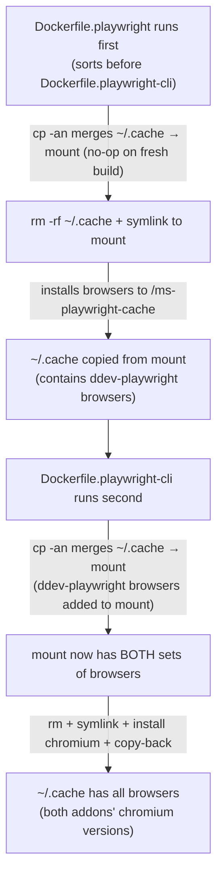

# Plan: Preserve Both Addons' Browsers When Co-Installed

## Original Work Order

> When both `ddev-playwright` and `ddev-playwright-cli` are installed, each addon's Dockerfile uses the same `/dot-cache` build cache mount and the same `~/.cache` copy-back pattern. Whichever Dockerfile runs last does `rm -rf ~/.cache` then `cp -a /dot-cache/*`, which only contains what that RUN instruction installed — the previous addon's browsers are deleted.
>
> Additionally, the generic `/dot-cache` mount name risks collisions with other unrelated addons. Both repos should use a Playwright-specific mount name.

## Plan Clarifications

| Question | Answer |
|----------|--------|
| Should the plan cover both repos? | Yes — both `ddev-playwright-cli` and `Lullabot/ddev-playwright` |
| Is ddev-playwright available locally? | Yes, cloned at `~/lullabot/ddev-playwright` |
| Should ddev-playwright also add `rm -rf ~/.cache` before symlinking? | Yes — makes both Dockerfiles order-independent |

## Executive Summary

When both DDEV Playwright addons are installed in the same project, a Docker build-cache collision destroys one addon's browsers. Both addons mount a generic `/dot-cache` cache volume, then blindly wipe `~/.cache` and replace it with the mount's contents. Because each RUN layer only populates the mount with its own browsers, whichever Dockerfile executes last overwrites the other's work.

The fix is two-fold: rename the cache mount to `/ms-playwright-cache` (eliminating collisions with unrelated addons) and add a non-destructive merge step (`cp -an`) that copies any pre-existing `~/.cache` contents into the mount before the wipe-and-symlink sequence. This ensures browsers from the earlier Dockerfile survive into the final image.

Both repos require the same structural change to their Dockerfiles, delivered as separate PRs.

## Context

### Current State vs Target State

| Current State | Target State | Why? |
|---|---|---|
| Both addons use generic `/dot-cache` mount name | Both use `/ms-playwright-cache` | Avoid collisions with unrelated addons and make the mount's purpose explicit |
| `rm -rf ~/.cache` runs before symlinking, destroying browsers from earlier layers | `cp -an ~/.cache/* /ms-playwright-cache/` merges existing browsers into the mount before wiping | Preserve browsers installed by whichever addon's Dockerfile ran first |
| Co-installing both addons leaves only one set of browsers | Co-installing preserves both sets of browsers in `~/.cache/ms-playwright/` | Users expect both `playwright-cli` and project-level `npx playwright` to work simultaneously |

### Background

DDEV addon Dockerfiles are executed as layers in a single image build. The order depends on filename sort. When `ddev-playwright` (`Dockerfile.playwright`) and `ddev-playwright-cli` (`Dockerfile.playwright-cli`) are both enabled, they run sequentially — `Dockerfile.playwright` sorts before `Dockerfile.playwright-cli`, so `ddev-playwright` runs first.

Docker BuildKit cache mounts are shared by target path. Both addons write to the same `/dot-cache` volume, but each RUN instruction clobbers `~/.cache` and replaces it with a symlink to the mount. The mount retains content across builds, but the `cp -a /dot-cache/* ~/.cache/` at the end only copies what the current instruction put there — not what a previous layer's instruction stored.

The `cp -an` flag (`-a` preserve attributes, `-n` no-clobber) is the key to the fix: it merges the earlier addon's browsers into the cache mount without overwriting anything the current addon just installed.

**Structural difference between the two Dockerfiles**: `ddev-playwright-cli` already does `rm -rf ~/.cache` before symlinking (it accounts for `ddev-playwright` having created `~/.cache` as a real directory). `ddev-playwright` does **not** — it assumes it runs first and `~/.cache` doesn't exist. The fix must add `rm -rf ~/.cache` to `ddev-playwright` as well, making both Dockerfiles order-independent.

**Repository locations**:
- `ddev-playwright-cli`: current repo (`/home/claude/ddev-playwright-cli`)
- `ddev-playwright`: `~/lullabot/ddev-playwright`

## Architectural Approach



### Cache Mount Rename

**Objective**: Eliminate the generic `/dot-cache` name to prevent collisions with unrelated addons and make intent clear.

In both repos, every occurrence of `--mount=type=cache,target=/dot-cache` and references to `/dot-cache` in the RUN command are renamed to `/ms-playwright-cache`. This is a straightforward find-and-replace within the single RUN instruction in each Dockerfile.

### Non-Destructive Merge Step

**Objective**: Preserve browsers from an earlier Dockerfile layer before the wipe-and-symlink sequence.

A new `cp -an` line is inserted immediately after `chown` and before `rm -rf ~/.cache`:

```
cp -an /home/$username/.cache/* /ms-playwright-cache/ 2>/dev/null;
```

- `-a` preserves ownership, permissions, and symlinks
- `-n` never overwrites existing files (so a rebuild doesn't clobber the mount's cached content)
- `2>/dev/null;` suppresses the error when `~/.cache` doesn't exist (fresh build) and uses `;` instead of `&&` so a missing source directory doesn't fail the chain

This must be added to **both** repos so that whichever Dockerfile runs second performs the merge.

### Order-Independence for ddev-playwright

**Objective**: Make `ddev-playwright`'s Dockerfile safe regardless of execution order.

Currently `ddev-playwright` does `ln -s /dot-cache /home/$username/.cache` without first removing `~/.cache`. If another addon has already created `~/.cache` as a real directory, the `ln -s` would create a symlink *inside* that directory rather than replacing it. Adding `rm -rf /home/$username/.cache` before the symlink — matching what `ddev-playwright-cli` already does — makes both Dockerfiles order-independent.

### Comment Updates

**Objective**: Keep the inline documentation accurate.

The existing comment blocks in both Dockerfiles reference `/dot-cache` and explain the symlink pattern. These comments need to be updated to reference `/ms-playwright-cache` and explain the new merge step.

## Risk Considerations and Mitigation Strategies

<details>
<summary>Technical Risks</summary>

- **Mount name mismatch during transition**: If a user updates only one addon, the two Dockerfiles will use different mount names (`/dot-cache` vs `/ms-playwright-cache`). This is actually harmless — separate mounts mean separate caches, and the `cp -an` merge step in the updated addon will still pick up browsers from `~/.cache` written by the older addon's copy-back step.
    - **Mitigation**: No action needed; the design is inherently safe during partial upgrades.

- **`cp -an` unavailable on non-GNU coreutils**: The `-n` (no-clobber) flag is a GNU extension.
    - **Mitigation**: DDEV web containers are Debian-based and ship GNU coreutils. This is not a concern.

</details>

<details>
<summary>Implementation Risks</summary>

- **Forgetting to update one repo**: The fix requires changes in both `ddev-playwright-cli` and `Lullabot/ddev-playwright`.
    - **Mitigation**: Plan explicitly covers both repos with separate tasks. The merge step is safe even when only one repo is updated.

</details>

## Success Criteria

### Primary Success Criteria
1. Both addons installed in a test DDEV project: `ddev exec ls ~/.cache/ms-playwright/` shows two `chromium-XXXX/` directories (different versions from each addon)
2. `ddev exec playwright-cli --version` succeeds (ddev-playwright-cli browsers work)
3. `ddev exec npx playwright --version` succeeds (ddev-playwright browsers work)
4. A clean build (no prior cache) with only one addon installed still works correctly

## Self Validation

1. Create a test DDEV project and install both addons
2. Run `ddev restart` to trigger a full rebuild
3. Run `ddev exec ls -la ~/.cache/ms-playwright/` and verify two separate `chromium-*` directories exist
4. Run `ddev exec playwright-cli --version` and confirm it outputs a version number
5. Run `ddev exec npx playwright --version` and confirm it outputs a version number
6. Remove ddev-playwright, run `ddev restart`, and verify `ddev exec playwright-cli --version` still works
7. Inspect the Dockerfile comments to confirm they reference `/ms-playwright-cache` and explain the merge step

## Documentation

- Update inline Dockerfile comments in both repos to explain the merge step and mount rename
- No README changes required — the user-facing behavior is unchanged

## Resource Requirements

### Development Skills
- Dockerfile / Docker BuildKit cache mount semantics
- DDEV addon architecture (disabled Dockerfile pattern, hook lifecycle)
- Shell scripting (cp flags, error suppression)

### Technical Infrastructure
- DDEV local environment for testing
- Access to both repositories (`e0ipso/ddev-playwright-cli` and `Lullabot/ddev-playwright`)

## Notes

- The `ddev-playwright` changes should be submitted as a separate PR to the Lullabot/ddev-playwright repo
- The order in which the two PRs are merged does not matter — each change is independently safe

### Change Log
- 2026-03-17: Initial plan created
- 2026-03-17: Refined — added clarification about `ddev-playwright` missing `rm -rf ~/.cache` before symlink; added order-independence section; improved mermaid diagram to show both addons' merge flow; documented repo locations
